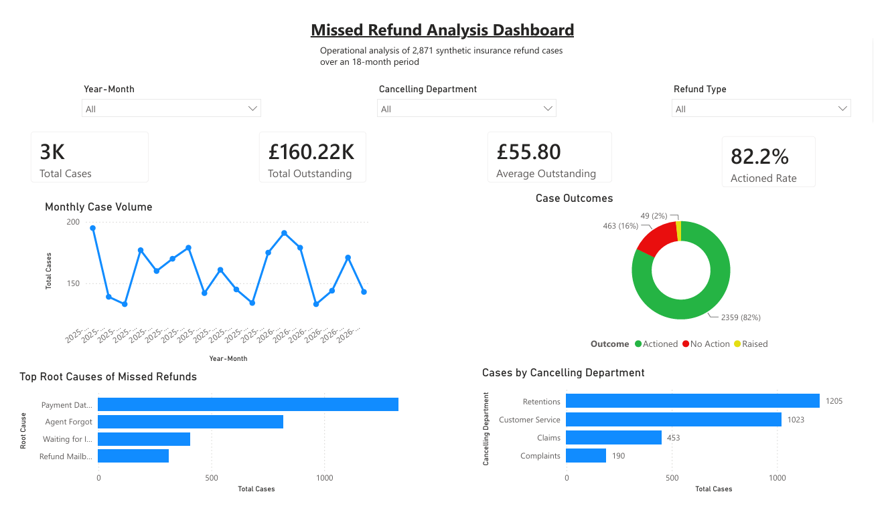

# Missed Refund Analysis and Process Improvement

An end-to-end data analytics portfolio project using Python, SQL and Power BI to analyse a synthetic insurance operations dataset.

## Overview

This project recreates a manual refund tracking process using synthetic data based on a real operational workflow within the insurance industry.

The aim is to investigate the characteristics of outstanding balances and identify opportunities to improve refund processing, reporting and operational efficiency.

No real customer or company data is used in this project.

---

## Business Problem

The Debt Held process relies on a monthly Power BI snapshot that is exported into an Excel workbook. Agents manually review each case, determine whether a refund is required and update the workbook as work progresses.

This project investigates the operational process using synthetic data to answer business questions and propose process improvements.

---

## Project Goals

- Understand the Debt Held workflow
- Create a realistic synthetic dataset
- Analyse refund processing performance
- Build an interactive Power BI dashboard
- Recommend improvements to the process

---

## Dashboard Preview



The Power BI dashboard provides an executive view of the synthetic operational dataset, allowing users to explore trends, identify operational issues and filter results by month, department and refund type.

Key dashboard features include:

- Executive KPI summary
- Monthly case volume trends
- Case outcome distribution
- Root cause analysis
- Department-level analysis
- Interactive slicers

---

## Key Findings

Analysis of the synthetic dataset identified several operational patterns:

- The dataset contains **2,871 cases** with a combined outstanding value of **£160,215.80**.
- Approximately **82% of reviewed cases** resulted in the analyst processing a refund, indicating substantial missed-refund exposure within the simulated workload.
- `Payment Date Misunderstood` was the leading root cause, accounting for approximately **46% of cases**.
- Following the simulated training intervention, payment-date misunderstandings decreased from **55.7% to 40.2%**.
- After the simulated new starters joined, this increased to **44.2%**, demonstrating how onboarding changes could be monitored.
- Refund mailbox delays represented **16.8% of cases during December and January**, compared with **9.5% in other months**.
- Retentions and Customer Service generated approximately **78% of missed-refund cases**, although total cancellation volumes would be required to compare departmental error rates fairly.

These findings demonstrate analytical methods using intentionally generated scenarios and do not represent the performance of a real organisation.

---

## Repository Structure

```text
missed-refund-analysis/
│
├── dashboard/
│   └── Missed_Refund_Analysis_Dashboard.pbix
│
├── data/
│   ├── raw/                         # Synthetic monthly snapshots
│   ├── reference/                   # Supporting category data
│   ├── weekly/                      # Generated weekly operational data
│   └── combined_missed_refunds.csv
├── docs/
│   ├── business-process.md
│   ├── business_profile.md
│   ├── business_questions.md
│   ├── business_rules.md
│   ├── data-dictionary.md
│   ├── data_model.md
│   ├── operational_workflow.md
│   └── project-charter.md
│
├── images/
│   └── dashboard-overview.png
│
├── notebooks/
│   ├── 01_generate_powerbi_snapshot.ipynb
│   ├── 02_validate_snapshot.ipynb
│   ├── 03_exploratory_analysis.ipynb
│   ├── 04_process_improvements.ipynb
│   ├── 05_create_sql_database.ipynb
│   └── 06_sql_business_analysis.ipynb
│   └── 07_generate_weekly_status_feed.ipynb
│
├── sql/                             # Generated SQLite database location
├── .gitignore
├── README.md
└── requirements.txt
```

---

## Running the Project

Install the required Python packages:

```bash
pip install -r requirements.txt
```

Run the notebooks in numerical order. Notebook 05 creates the local SQLite database required by notebook 06, and notebook 07 generates the weekly operational datasets.

The SQLite database and weekly CSV files can be regenerated from the notebooks.

## Skills Demonstrated

This project demonstrates practical experience with:

- **Python** – generating and preparing synthetic datasets
- **Pandas** – data manipulation and transformation
- **SQL & SQLite** – creating a reproducible database, querying operational data, using aggregation, grouping, `CASE` statements and conditional calculations
- **Power BI** – interactive dashboard development
- **DAX** – creating KPIs and business measures
- **Data Visualisation** – presenting operational insights through charts and dashboards
- **Business Analysis** – identifying trends, root causes and improvement opportunities
- **Data Modelling** – structuring data for reporting and analysis
- **Git & GitHub** – version control and project documentation

---

## Tools

- Python
- Pandas
- SQL
- Power BI
- Git & GitHub
- VS Code

## About the Data

This project does not contain real customer or company data.

The dataset is entirely synthetic and has been generated using business rules based on operational experience within an insurance environment.

The distributions and relationships are designed to simulate realistic patterns rather than reproduce actual company data.

## Why Synthetic Data?

This project was inspired by a genuine operational process encountered in an insurance environment.

To protect customer privacy and confidential business information, all data used in this repository is synthetically generated using documented business rules and operational assumptions.

The aim is to demonstrate analytical thinking, data modelling and reporting techniques rather than reproduce production data.